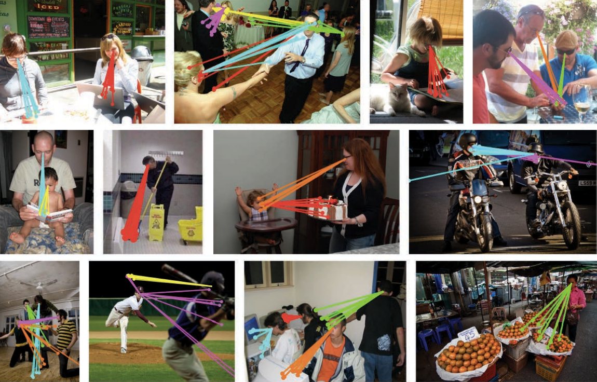

# Where are They looking?

## Resumen
Los humanos tienen la notable capacidad de seguir la mirada de otras personas, cuando conversas con alguien y observas algo destrás de él (ella) volteará por instinto.
Esta habilidad va de mano con la empatía, que nos permite asumir lo que otra persona esta pensando, como se siente o si va a realizar a alguna acción.

En el presente se expone la propuesta del paper
_[Where are they looking?](http://gazefollow.csail.mit.edu/)_ cuyo enfoque comprende el uso de redes neuronales profundas para el seguimiento de miradas con un nuevo conjunto de datos de referencia 'GazeFollow'

El enfoque consiste en tomar la posición de la cabeza en la imagen, para identifica el rango de visión y los objetos contenidos en dicho rango; y por medio de la red profunda concluir que se está observando. Este enfoque produce resultados confiables, incluso cuando solo se ve la parte posterior de la cabeza. Pero aún no se tiene el rendimiento humano en esta tarea.

---------------------------------------------

## Introducción ##
texto seccion 1

#### Trabajos Relacionados
- __Saliency__
- __Gaze__

---------------------------------------------

## Gaze Follow: A Large Scale Gaze-Following dataset
texto seccion 2

---------------------------------------------

## Learning to Follow Gaze

#### Gaze and Saliency Pathways
__Saliency map__
__Gaze mask__
__Pathway visualization__
#### Multimodal Predictions
__Shifted grids:__
#### Training
__Implementation details:__

---------------------------------------------

## Experiments
#### Setup
#### Resultados
#### Análisis
__Ablation study:__
__Internal representation:__
__Automatic head detection:__

---------------------------------------------

## Conclusión
